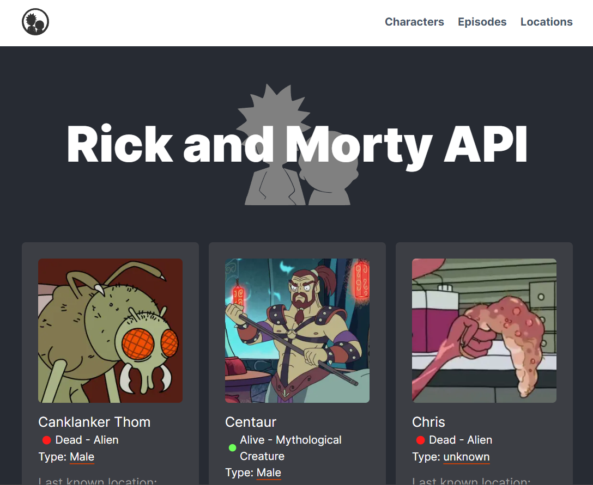
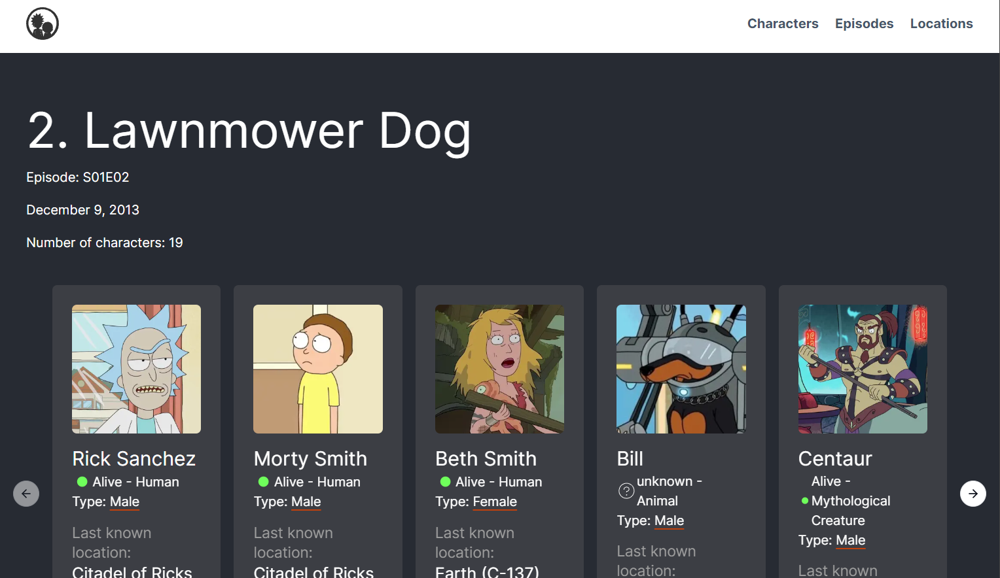
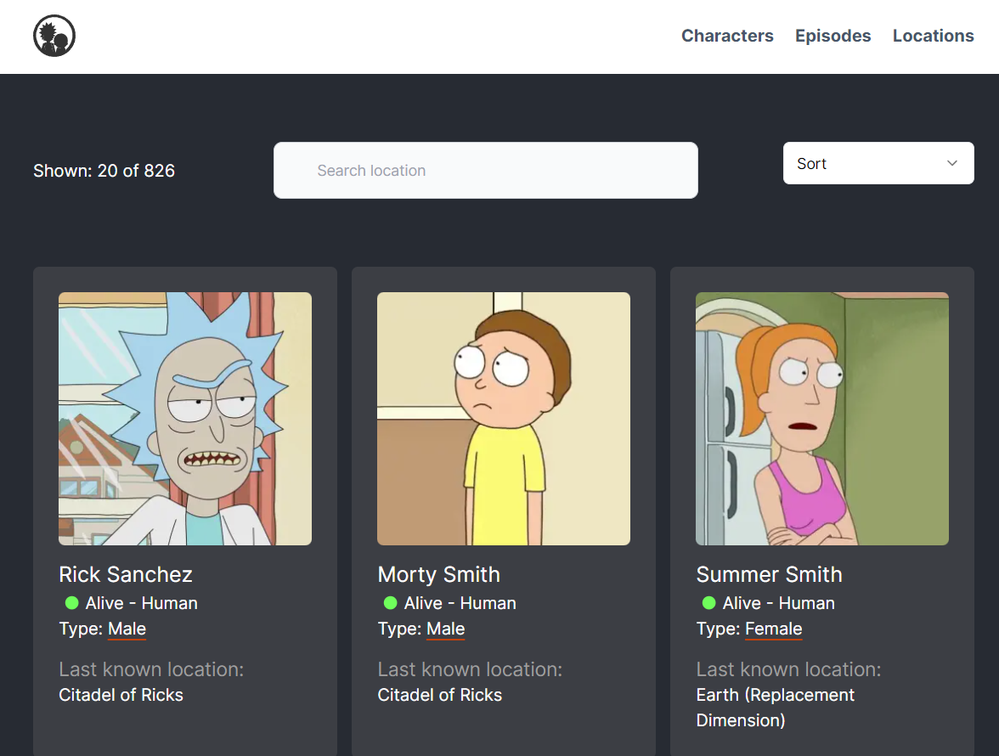
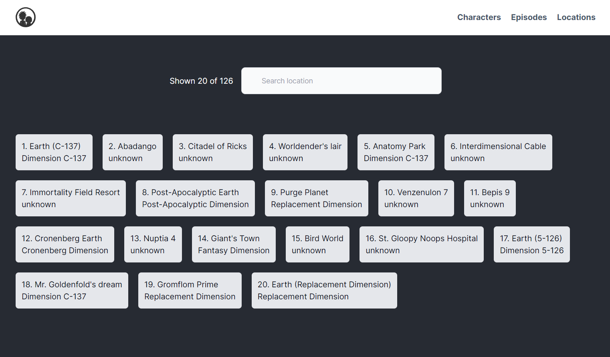

`#rick-morty-api` `#react-js` `#Next` `#Typescript` `#Apollo` `#Graph Ql`
`#master-in-software-engineering`

# RICK-AND-MORTY-NEXT

> In this project we will build a Next.js 14 framework with SSR using the Rick & Morty API.

## Getting Started

These instructions will get you a copy of the project up and running on your
local machine for development and testing purposes.

See deployment for notes on how to deploy the project on a live system.

### The repository

First, you will need to `clone` or `fork` the repository into your Github
account:


```
$ git clone https://github.com/ortima/Rick-and-Morty-Next-14.git
```

### Installing

First, you will need to install the dependencies with: `npm install`

```sh
$ npm install
```

## Deployment

This project is not intended to be deployed but you could use Netlify for it.

## Technologies used

- React.js
- Next.js 14
- Apollo/GrapQl
- TS
- Shadcn/ui + Tailwind CSS

## Project features

### Home page

Path: `/`



### Episodes page

Path: `/episodes/:id`



### Characters page

Path: `/characters`



### Character page

Path: `/characters/:id`


### Locations page

Path: `/locations`


